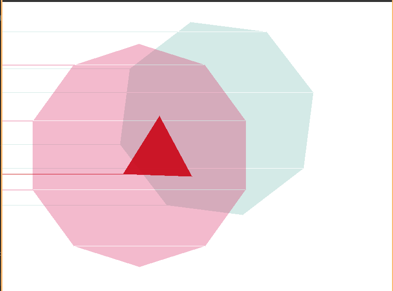

The algorithm for determining whether a point lies inside or outside a particular shape involves drawing a line 
parallel to the x axis from the point and finding the number of points it cuts the shape. If it cuts odd number of times then
it is iniside the polygon otherwise its out. This can be considered intuitively true because a polygon is a closed figure thus a point inside a 
polygon is enclosed by it all of the 360 degrees, drawing a line from the point would intersect the polygon once atleast for sure. But if the polygon
is a little coiled the line would first enter the polygon then leave it thus giving even number of intersections later. Thus there are always odd number
of intersections if the point is inside. There are edge cases when the line is touching the edge of the polygon

.

The degenrate lines cause a lot of problem as I was trying to fill up color in the polygon using this test.

Resulting in this

The solution for this is to find whether a point when extended to a line passes through a vertex, the code for this is simple as we only need to compare the y coordinates of the line
When the line passes through a vertex it is counted doubly in intersections, thus we need to count only once. We say that whenever we find an intersection we check if the line passes through
the top coordinates of the segment forming the sides of the polygon, if it does we don't increment count. Now we come across degenrate points like G in the picture

