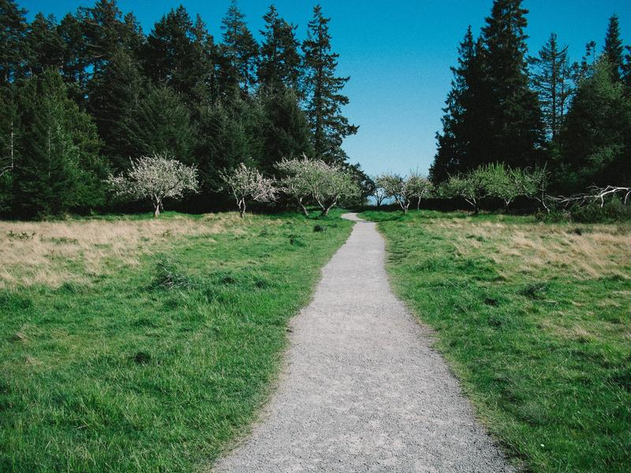
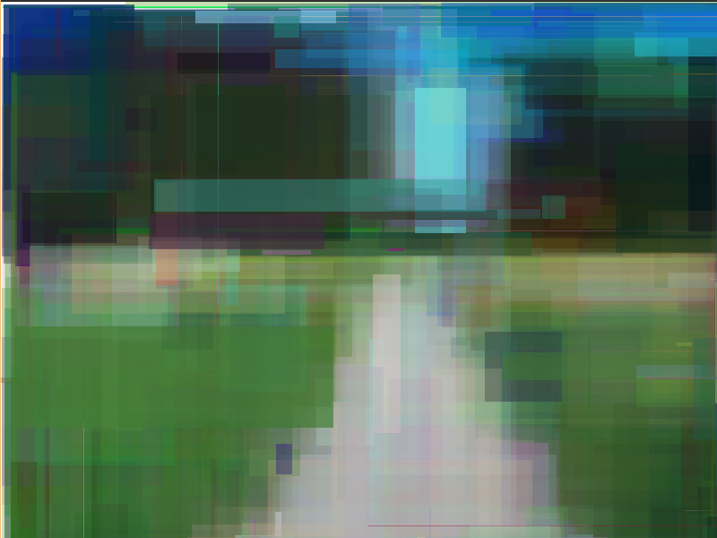

# Geometric-Image-Synthesis

This project aims to recreate normal images using just geometric shapes such as rectangles, triangles etc.
This project is inspired and in a way translation of these awesome projects:
- [Primitive by Fogleman](https://github.com/fogleman/primitive)
- [Hill Climbing by Muzcaw](https://github.com/Muzkaw/Hill-Climbing)
- [Genetic Programming: Evolution of Mona Lisa](https://rogerjohansson.blog/2008/12/07/genetic-programming-evolution-of-mona-lisa/)
- [Hackernews article](https://news.ycombinator.com/item?id=25485493)

### May 28 2022

Currently, it is a very bare-bones project, which creates a random rectangle and computes the error after adding the rectangle to the image and
before adding it, if the error has reduced it adds the rectangle otherwise it repeats the process.A very basic hill climbing. The algorithm is slow and puffs and fumes adding around 1000 of these
rectangles, while not accurately describing the image, it needs a lot of improvement. I have to experiment and learn about error types to see how they affect per
formance and results. I also have to implement better algorithms described above.

